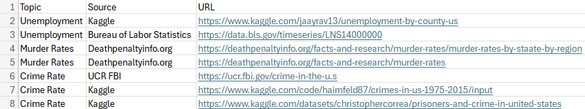

```{r setup, include=FALSE}
knitr::opts_chunk$set(echo = TRUE)
# Load Libraries
library(tidyverse)
library(raster)          #raster()
library(sf)              #st_read()
library(ggspatial)       #annotation_scale,annotation_north_arrow
library(ggnewscale)      #new_scale_color() 
#library(ggsn)            #scalebar()
library(shiny)           #Shiny app
library(plotly)          #plot_ly()
library(gridExtra)       #grid.arrange()


```

# Crime and Unemployment

A comparative visual analysis of crime and unemployment rates.

## 1 Data

The data proposed in this project is a series of CSV and Shape files processed down from several sources. The table below lists those sources, including Kaggle, Bereau of Labor Statistics, and FBI.



## 2 Project Objectives

The object of this project is to explore the relationship between crime and unemployment rates through data visualization. In module 13, three important questions were asked. 

What is the trend off unemployment and crime rates of specific regions over time?

What is the distribution of unemployment and crime rates of specific time at specific spatial scale?

What is a relationship between unemployment and crime rates?

The methods used to solve these problems, or answer these types of questions, are the data visualization types chosen. In this project, we used two geospatial maps, two time series line plots, and a scatter plot. These methods were selected as they clearly display to the audience the spread of data across space and time. The audience can intuitively guess just based on the colors of the map or placement of the points in the lines what the data means.

## 3 Data Processing and data visualization

### Data preprocessing: 

```{r preproc, results=FALSE, message=FALSE}
#
########################Initialize Data#######################
# Setup Data
setwd("~/School/DS605/DSCI605_Labs/FinalProject/final_data")
Unemployrate = read_csv("unemployment_county.csv")
Crimerate = read_csv("crime_and_incarceration_by_state.csv")
States = st_read("tl_2019_us_state/tl_2019_us_state.shp")
########################Initialize Data#######################
#


#
########################Process Polygon Data#######################
# Filter Regions Outside Contiguous USA
Contiguous_state = States%>% filter(STUSPS!="AK"& 
                                       STUSPS!="AS"& 
                                       STUSPS!="MP"& 
                                       STUSPS!="PR"& 
                                       STUSPS!="VI"& 
                                       STUSPS!="HI"& 
                                       STUSPS!="GU")
# Check Length
length(unique(Contiguous_state$STUSPS))
########################Process Polygon Data#######################
#


#
########################Process Unemployment Data#######################
# Check the length of State Column
unique(Unemployrate $State)
length(unique(Unemployrate $State))

# Process Unemployment 1 
Unemployrate = Unemployrate %>% 
  #Filter Non-Contiguous
  filter(State!="AK"& State!="HI") %>%
  #Group States and Years
  group_by(State,Year) %>% 
  #Summarize Data with new variables
  summarise(Totalforce=sum(`Labor Force`),
            Totalemployed=sum(Employed),
            Totalunemployed=sum(Unemployed),
            Meanrate=mean(`Unemployment Rate`,rm.na=TRUE)
  )

# Check the length of State again  
length(unique(Unemployrate $State))

# Process Unemployment 2
Unemployrate = Unemployrate %>% 
  #Match the column name of the crime data set
  rename("STUSPS"="State") %>% 
  #Get selection of years
  filter(Year %in% c(2007:2014))
########################Process Unemployment Data#######################
#


#
########################Process Crime Data#######################
# Check the length of states (jurisdiction)
unique(Crimerate$jurisdiction)
length(unique(Crimerate$jurisdiction))
head(Crimerate)

# Process Data
Crimerate =  Crimerate %>% 
  #Update Jurisdiction to STUSPS (Matches others)
  rename("STUSPS"="jurisdiction") %>% 
  #Update year to Year (Matches others)
  rename("Year"="year") %>% 
  #Filter for only contiguous US
  filter(STUSPS!="FEDERAL"& STUSPS!="ALASKA"& STUSPS!="HAWAII") %>% #library(stringr)
  #Filter for selected years 
  filter(Year %in% c(2007:2014))

# Recheck the data
length(unique(Crimerate$STUSPS))
head(Crimerate)

# Changes the state names in the state column "STUSPS"
Crimerate$STUSPS = state.abb[match(str_to_title(Crimerate$STUSPS),state.name)]

# Calculate the crimerate
Crimerate = Crimerate %>% 
  #Get Rate as a percent (value/total*100)
  mutate(Crimerate=(violent_crime_total/state_population)*100) %>% 
  dplyr::mutate_if(is.numeric, round, 1)
########################Process Crime Data#######################
#


save(list = c("Crimerate", "Unemployrate","Contiguous_state"), file = "CleaneData.Rdata")
##################Read data file into R
load(file = "CleaneData.Rdata")


#
########################The required columns#######################
# As CS_Erate, Join Polygon and Unemployment Tables (Merge to the Right)
CS_Erate<-right_join(Contiguous_state, Unemployrate, 
                     by = c("STUSPS"))
# As CS_Erate_Crate, Join CS_Erate and Crime Tables (Merge to the Right)
CS_Erate_Crate = right_join(CS_Erate, Crimerate, 
                             by = c("STUSPS","Year"))
# With newly joined tables, select only the needed columns
CS_Erate_Crate1 = CS_Erate_Crate %>% 
  select(REGION,STUSPS,NAME,Year,Meanrate,Crimerate) %>% 
  rename("Unemplyrate"="Meanrate")
########################The required columns#######################
#


#
########################Final Check and Save#######################
# Check for missing values
which(is.na(CS_Erate_Crate1$REGION))
# Save the object as CS_Erate_CrateCombined.Rds
#saveRDS(CS_Erate_Crate1, file = "CS_Erate_CrateCombined1.Rds")
########################Final Check and Save#######################
#
```

### EDA analysis:

```{r visualization, results=FALSE, message=FALSE}
#
########################Initialize Data#######################
# Setup Data
setwd("~/FinalProject")
newDS = readRDS("CS_Erate_CrateCombined1.Rds")
newDF = as.data.frame(newDS)
#newDF
########################Initialize Data#######################
#


#
########################Plotly Time Series#######################
#Filter Data for Just the Desired States
timeline = newDF %>%
  filter(NAME=="Indiana" | NAME=="Illinois" | NAME=="Michigan"| NAME=="Ohio" ) %>%
  #Add Day and Month Columns for Date Object Column
  mutate(Day = 1) %>%
  mutate(Month = 1) %>%
  #Add Column for Date Object
  mutate(Date=as.Date(format(as.Date(paste(Day, Month, Year, sep = '.'),"%d.%m.%Y"),"%Y-%m-%d")))

#Unemployment Plot
plot_ly(data=timeline,x=~Date,y=~Unemplyrate,type="scatter",mode="lines",color=~NAME) %>%
  layout(title="Unemployment Rate Over Time",xaxis=list(title="Year"),yaxis=list(title="Unemployment Rate"))

#Crime Plot
plot_ly(data=timeline,x=~Date,y=~Crimerate,type="scatter",mode="lines",color=~NAME) %>%
  layout(title="Crime Rate Over Time",xaxis=list(title="Year"),yaxis=list(title="Crime Rate"))
########################Plotly Time Series#######################
#


#
########################GGPlot Spatial Map#######################
# A spatial map of the contiguous US in 2014
geoDF = newDF %>%
  filter(Year == "2014")

#Set Color Palette
mapPal = colorspace::diverge_hcl(20, palette = "Blue-Red")

#Unemployment Plot
ggplot() +
  #States Shape
  geom_sf(data=geoDF$geometry,aes(fill=as.factor(floor(geoDF$Unemplyrate))))+
  #Scale Color With Palette
  scale_fill_manual(values = mapPal)+
  #Scale Bar
  annotation_scale(location="bl", width_hint=0.5) +
  #North Arrow
  annotation_north_arrow(location = "bl", which_north = "true",
                         pad_x = unit(0, "in"), pad_y = unit(0.2, "in"),
                         style = north_arrow_fancy_orienteering) +
  #Set Legend Position
  theme(legend.position = "bottom") +
  #Remove Legend Title
  labs(fill = "Unemployment Rate")+
  #Set font size for all texts
  theme(text = element_text(size=20)) +
  #Labels
  xlab("Longitude") + ylab("Latitude") +
  #Title
  ggtitle("2014 Unemplyment Rate Map over Contiguous US")


#Crime Plot
ggplot() +
  #States Shape
  geom_sf(data=geoDF$geometry,aes(fill=as.factor(geoDF$Crimerate)))+
  #Scale Color With Palette
  scale_fill_manual(values = mapPal)+
  #Scale Bar
  annotation_scale(location="bl", width_hint=0.5) +
  #North Arrow
  annotation_north_arrow(location = "bl", which_north = "true",
                         pad_x = unit(0, "in"), pad_y = unit(0.2, "in"),
                         style = north_arrow_fancy_orienteering) +
  #Set Legend Position
  theme(legend.position = "bottom") +
  #Remove Legend Title
  labs(fill = "Crime Rate")+
  #Set font size for all texts
  theme(text = element_text(size=20)) +
  #Labels
  xlab("Longitude") + ylab("Latitude") +
  #Title
  ggtitle("2014 Crime Rate Map over Contiguous US")
########################GGplot Spatial Map#######################
#


#
########################GGPlot Spatial Map#######################
# A spatial map of the contiguous US in 2014
geoDF = newDF %>%
  filter(Year == "2014")

#Set Color Palette
mapPal = colorspace::diverge_hcl(20, palette = "Blue-Red")

#Unemployment Plot
ggplot() +
  #States Shape
  geom_sf(data=geoDF$geometry,aes(fill=as.factor(floor(geoDF$Unemplyrate))))+
  #Scale Color With Palette
  scale_fill_manual(values = mapPal)+
  #Labels
  xlab("Longitude") + ylab("Latitude") +
  #Title
  ggtitle("Unemployment Rate Map over Contiguous US")


#Crime Plot
ggplot() +
  #States Shape
  geom_sf(data=geoDF$geometry,aes(fill=as.factor(floor(geoDF$CrimeRate))))+
  #Scale Color With Palette
  scale_fill_manual(values = mapPal)+
  #Labels
  xlab("Longitude") + ylab("Latitude") +
  #Title
  ggtitle("Unemployment Rate Map over Contiguous US")
########################GGplot Spatial Map#######################
#


#
########################Plotly Crime and Unemployment Scatter#######################
# Filter Data for Just 2014
sctr = newDF %>% filter(Year == "2014") 
#Plot Time 
plot_ly(data=sctr,x=~Crimerate,y=~Unemplyrate,type="scatter",mode="markers",color=~REGION) %>%
  layout(title="2014 Crime and Unemployment by Region",xaxis=list(title="Crime Rate per 100 People"),yaxis=list(title="Unemployment Rate per 100 People"))
########################Plotly Crime and Unemployment Scatter#######################
#


#
########################Scatter Plot#######################
# Scatter Plot of 2014's Unemploy/Crime Rates
sctr = newDF %>%
  # Get Just 2014
  filter(Year == "2014") %>%
  # Set X and Y Values
  ggplot(aes(x=Crimerate,y=Unemplyrate)) +
  # Add Data Points colored by Region
  geom_point(alpha=0.5,aes(color=REGION)) +
  #Set Title Text
  ggtitle("Unemployment Rate and Crime Rate in 2014") +
  #Set X and Y Label Text
  xlab("Crime Rate per 100 People") +
  ylab("Unemployment Rate per 100 People")+
  #Hide Legend Title
  theme(legend.title=element_blank())
#Draw Plot
sctr
########################Scatter Plot#######################
#
```

### Data analytics method

```{r}
# For example, the time series data visualization. Please explain the method in detailed information, and interpret the results.
```


## 4 Discussion and conclusion

[What information you can get from the graphs? What you can do more in the future.]

## 5 References

[List all references articles you refer for the final project]