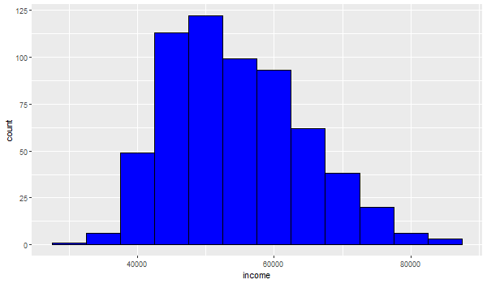

```{r setup, include=FALSE}
knitr::opts_chunk$set(echo = FALSE)
```

```{r}
setwd("C:/Users/maver/OneDrive/Documents/School/DS605/DSCI605_Labs/Module7")
```

# 1. How to emebed image into R Markdnow

This is an example of embedding images in your local folder into R Markdown.
For example, I have a illustration graph of the links between packages ggplot2, gtable, grid, egg and gridExtra under the folder 7.1. 


This is another way to insert the image and set the position for the image.

```{r rein0, fig.cap = "\\label{fig:rein0}Resized Histogram_png"}


```

